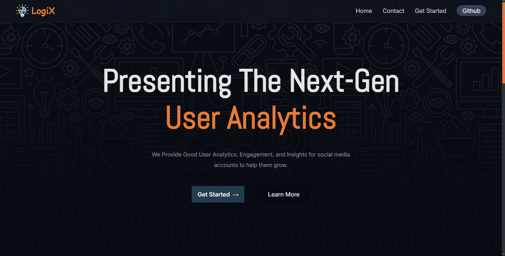
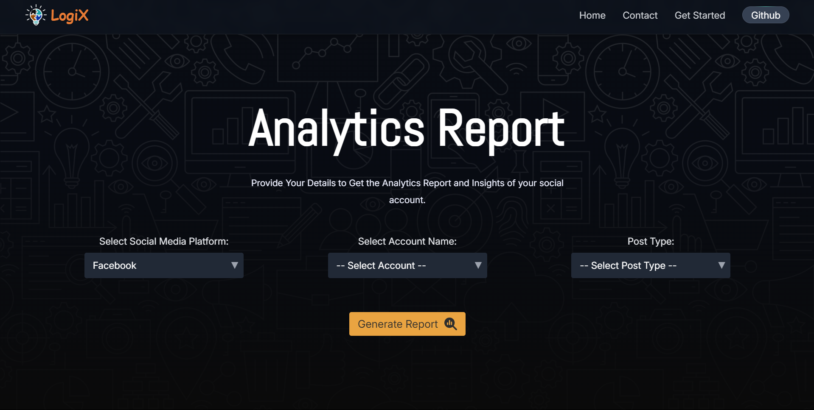
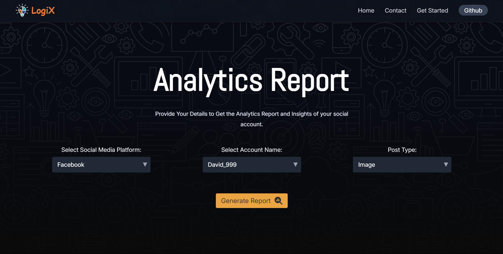
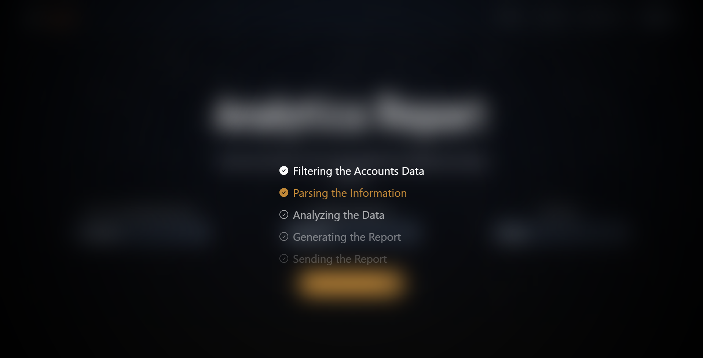
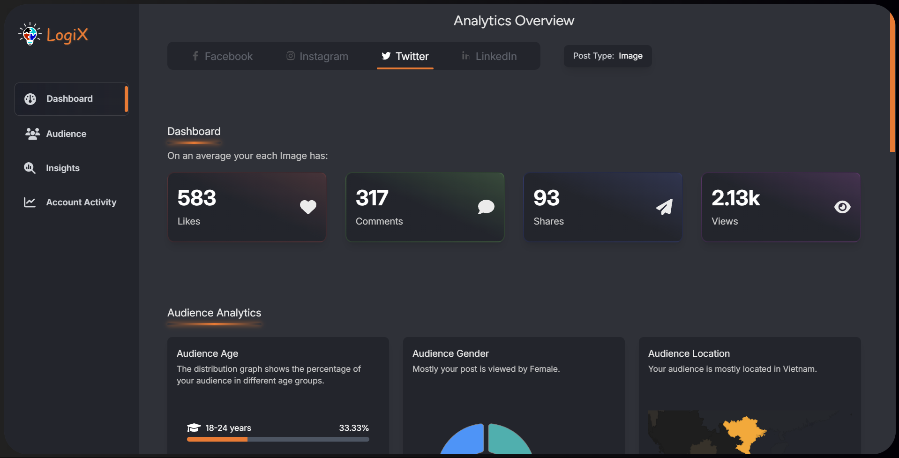

# Project: Social Media Performance Analysis
Social Media Performance Analysis is a web app developed for the assignment submission of THE Level SuperMind Hackathon. It provides insights into social media engagement, offering key metrics like likes, comments, shares, and audience demographics. The app leverages AI and a scalable database for automated reporting and optimization recommendations.

# Table of Contents

1. [Project Overview](#objective)
2. [Live Link](#live-link)
3. [Solution Overview](#solution-overview)
   - [Frontend](#frontend)
   - [Backend](#backend)
   - [Workflow Automation](#workflow-automation)
4. [Features](#features)
   - [Overview](#overview)
   - [Audience](#audience)
   - [Insights](#insights)
5. [Technologies Used](#technologies-used)
6. [How to Use the Website](#how-to-use-the-website)
7. [Team Members](#team-members)
8. [How to Run the Project](#how-to-run-the-project)
9. [Demo Video](#demo-video)
10. [Repository Structure](#repository-structure)
11. [Contact](#contact)

### Objective
The project aims to develop an advanced analytics module utilizing **Langflow** for workflow automation and **DataStax Astra DB** for scalable data storage. It is designed to analyze and generate actionable insights from engagement data of mock social media accounts. The module provides a comprehensive overview of social media performance, including key metrics like likes, comments, shares, and audience demographics, to help optimize content strategies.

## **Live Link**
[https://genai-hackathon.web.app/](https://genai-hackathon.web.app/)

## **Solution Overview**
Our solution focuses on creating a user-friendly web application to analyze and gain insights into social media engagement data. Key highlights of the project include:

1. **Frontend**: Built using **React** and styled with **Tailwind CSS** for a modern and responsive UI.
2. **Backend**: Powered by **DataStax Astra DB**, providing a robust database solution for handling large datasets efficiently.
3. **Workflow Automation**: Leveraging **Langflow** to design workflows and integrate **GPT models** for generating intelligent insights.

### Features
---

Our dashboard is divided into three major sections: **Overview**, **Audience**, and **Insights**. Each section provides unique metrics and insights for a thorough social media engagement analysis.

#### **Overview**
The **Overview** section provides an at-a-glance view of the key engagement metrics for a specific account and post type. It showcases four primary metrics:
- **Average Likes**: The average number of likes received by posts of the selected type.
- **Average Comments**: The average number of comments on the posts.
- **Average Shares**: The average number of shares on posts.
- **Average Views**: The average number of views or reach for the posts.

These metrics help users quickly evaluate the general performance of their social media posts.

#### **Audience**
The **Audience** section offers a deeper dive into the demographics of the account’s audience, including:
- **Audience Age**: The audience is categorized into four major age groups:
  - **18-24 years**
  - **25-34 years**
  - **35-44 years**
  - **45+ years**
  
  This section displays the percentage distribution of the audience across these age groups, giving valuable insights into which age ranges are most engaged with the account’s posts.

- **Audience Gender Distribution**: This metric shows the percentage breakdown of male and female viewers of the posts, providing a clear understanding of gender demographics.

- **Audience Location**: This section displays the country with the highest number of viewers, allowing users to gauge the geographical reach of their posts.

#### **Insights**
The **Insights** section provides actionable data to help optimize social media strategies. It includes the following metrics:
- **Reach vs. Time Stamp**: A bar graph that compares the number of people reached during two major periods: weekdays and weekends. The graph is further divided into four time slots:
  - **Morning**
  - **Afternoon**
  - **Evening**
  - **Night**
  
  This breakdown helps users identify the best times for posting to maximize reach.

- **Reach vs. Engagement**: This metric shows the percentage of people who interacted with a post (through likes, shares, or comments) versus the total reach (views). It highlights how engaging the content is to those who have seen it.

- **Conversion Ratio**: The conversion ratio shows the percentage of viewers who interacted with the post compared to the total impressions. This metric helps users evaluate the effectiveness of their content in converting viewers into engaged participants.

- **Top 5 Insights**: A detailed paragraph section that provides the top 5 insights based on the collected data. These insights summarize key findings, trends, and actionable recommendations for improving social media engagement.

These features work together to provide a comprehensive analysis of social media performance, empowering users with valuable insights for optimizing their content strategies.

## **Technologies Used**
| Technology                  | Purpose                              |
|------------------------------|--------------------------------------|
| **React**                   | Core framework for building the UI  |
| **Tailwind CSS**            | Styling and responsive design       |
| **DataStax Astra DB**       | Scalable database for backend       |
| **Langflow**                | Workflow creation and GPT integration|
| **Firebase**                | Authentication and hosting          |
| **Express.js**              | Backend framework                   |

## **How to Use the Website**
1. **Get Started**: Click the **"Get Started"** button on the homepage.  
   

2. **Platform Selection**: Choose the desired social media platform from the dropdown menu.  
   

3. **Customize Analysis**: Select the account and post type for analysis.  
   

4. **Generate Report**: Click the **"Generate Report"** button to analyze the data.  
   

5. **Account Dashboard**: View detailed insights on the Account Dashboard.  
   

## **Team Members**
| Name               | Title                      | Contact                        | Profile Image |
|---------------------|----------------------------|--------------------------------|---------------|
| **Ayush Tripathi**  | Team Leader & Frontend Developer | [ayushflows@gmail.com](mailto:ayushflows@gmail.com) |  |
| **Ankur Kumar**     | UI/UX Designer & Presenter | [22cs3073@rgipt.ac.in](mailto:22cs3073@rgipt.ac.in) |  |
| **Bhagawat Karhale**| AI Developer              | [bhagawatkarhale7@gmail.com](mailto:bhagawatkarhale7@gmail.com) |  |
| **Nitesh Saini**    | Backend Developer          | [22cs2015@rgipt.ac.in](mailto:22cs2015@rgipt.ac.in) |  |
| **Rishabh Kumar**   | Data Analyst               | [22cs3047@rgipt.ac.in](mailto:22cs3047@rgipt.ac.in) |  |

### How to Run the Project
1. Clone the repository.
2. Navigate to the frontend and backend folders for detailed setup instructions.
3. Run the frontend and backend servers.
4. Open the application in your browser.

### Demo Video
[YouTube Video Link](#)

### Repository Structure
- **frontend/**: Contains the frontend code.
- **backend/**: Contains the backend code.

### Contact
For any queries, please contact us at [ayushflows@gmail.com](mailto:ayushflows@gmail.com).
