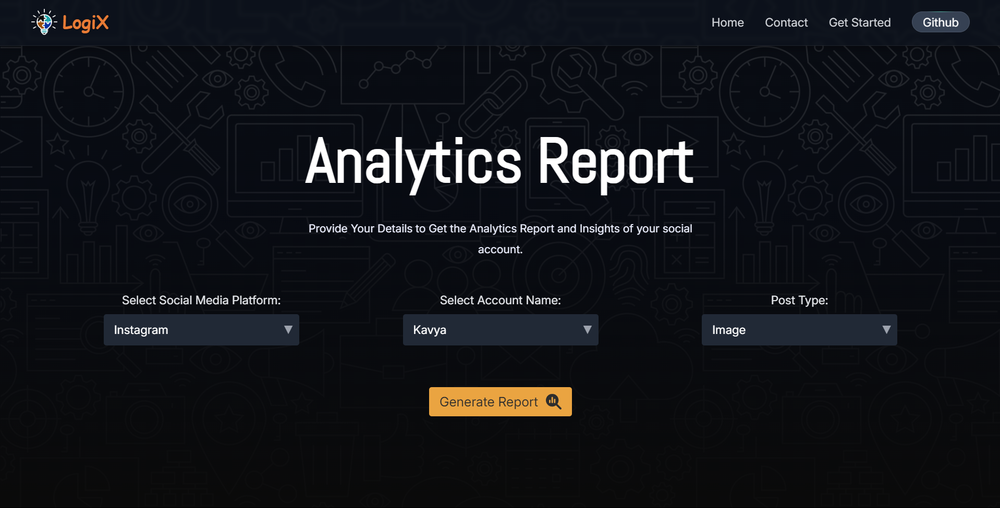
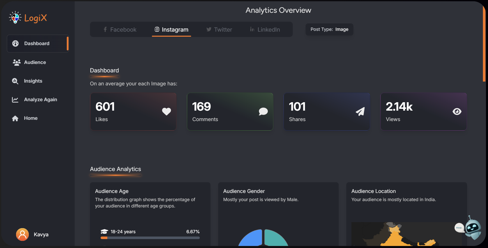

# Project: Social Media Performance Analysis

**Social Media Performance Analysis** is a web application developed for the assignment submission of **The Level SuperMind Hackathon**. It is designed to provide detailed insights into social media engagement, analyzing key metrics like likes, comments, shares, and audience demographics. The application leverages AI for generating insights and uses a scalable database solution for efficient reporting. By integrating AI-driven recommendations, this project helps users optimize their social media content strategies.

**Take a look at it:** [https://genai-hackathon.web.app/](https://genai-hackathon.web.app/)

---

# Table of Contents

1. [Project Overview](#objective)
2. [Live Link](#live-link)
3. [Solution Overview](#solution-overview)
   - [Frontend](#frontend)
   - [Backend](#backend)
   - [Workflow Automation](#workflow-automation)
4. [Features](#features)
   - [Overview](#overview)
   - [Audience](#audience)
   - [Insights](#insights)
5. [Technologies Used](#technologies-used)
6. [How to Use the Website](#how-to-use-the-website)
7. [Team Members](#team-members)
8. [How to Run the Project](#how-to-run-the-project)
9. [Demo Video](#demo-video)
10. [Repository Structure](#repository-structure)
11. [Contact](#contact)

---

## Objective

The **Social Media Performance Analysis** project aims to develop an advanced analytics module using **Langflow** for workflow automation and **DataStax Astra DB** for scalable data storage. The web app analyzes engagement data from mock social media accounts and generates actionable insights to optimize content strategies. It offers a comprehensive overview of key engagement metrics such as likes, comments, shares, and audience demographics.

This module helps social media managers and content creators track their social media performance and make data-driven decisions for future campaigns.

---

## ⚡ Problem Statement

### **Pre-Hackathon Assignment: Social Media Performance Analysis**  
The challenge was to develop a basic analytics module that utilizes **Langflow** and **DataStax Astra DB** to analyze engagement data from mock social media accounts. The goal was to provide insights on how social media content performs based on various engagement metrics.

---

## **Live Link**

You can explore the live version of the project by clicking on the link below:
[https://genai-hackathon.web.app/](https://genai-hackathon.web.app/)

---

## **Solution Overview**

Our solution focuses on creating a user-friendly and interactive web application to analyze and gain insights into social media engagement data. The application provides real-time insights on post performance, audience demographics, and actionable recommendations.

### **Frontend**  
- The frontend is built using **React**, offering a fast, responsive, and dynamic user interface.  
- We have used **Tailwind CSS** to ensure that the design is modern and responsive across various screen sizes.

### **Backend**  
- The backend is powered by **DataStax Astra DB**, a scalable cloud-native database solution that handles large amounts of data efficiently.  
- **Express.js** is used for the backend framework, which ensures quick and reliable REST API handling.

### **Workflow Automation**  
- **Langflow** is used to design workflows that automate data retrieval, processing, and generation of insights.  
- We also integrated **GPT models** to generate personalized recommendations for optimizing social media strategies based on the collected data.

---

## **Features**

Our dashboard is divided into three major sections: **Overview**, **Audience**, and **Insights**. Each section provides unique metrics and insights for thorough social media engagement analysis.

### **Overview**  
The **Overview** section provides an at-a-glance view of the key engagement metrics for a specific account and post type. It displays:
- **Average Likes**: The average number of likes received by posts of the selected type.
- **Average Comments**: The average number of comments on the posts.
- **Average Shares**: The average number of shares on posts.
- **Average Views**: The average number of views or reach for the posts.

These metrics help users evaluate the general performance of their social media posts quickly.

### **Audience**  
The **Audience** section delves into the demographics of the account’s audience, including:
- **Audience Age**: The audience is categorized into four major age groups:
  - **18-24 years**
  - **25-34 years**
  - **35-44 years**
  - **45+ years**
  
  This section displays the percentage distribution of the audience across these age groups, offering insights into which demographics are most engaged.

- **Audience Gender Distribution**: Displays the percentage breakdown of male and female viewers, helping users understand gender demographics.

- **Audience Location**: Shows the country with the highest number of viewers, indicating the geographical reach of posts.

### **Insights**  
The **Insights** section offers actionable data to help optimize social media strategies. Key metrics include:
- **Reach vs. Time Stamp**: A bar graph comparing the number of people reached during weekdays and weekends, further divided into four time slots: Morning, Afternoon, Evening, and Night. This helps users determine the optimal times to post.
  
- **Reach vs. Engagement**: Shows the engagement rate (likes, shares, comments) relative to the reach (views), helping assess content effectiveness.
  
- **Conversion Ratio**: Displays the percentage of viewers who interacted with the post compared to the total impressions, indicating the success of converting viewers into active participants.
  
- **Top 5 Insights**: A detailed paragraph that summarizes the top insights, highlighting key trends and actionable recommendations to improve social media engagement.

These features work together to provide a holistic view of social media performance, helping users strategize and improve their content engagement.

---

## **Technologies Used**

| Technology                  | Purpose                              |
|------------------------------|--------------------------------------|
| **React**                   | Core framework for building the UI  |
| **Tailwind CSS**            | Styling and responsive design       |
| **DataStax Astra DB**       | Scalable database for backend       |
| **Langflow**                | Workflow creation and GPT integration|
| **Firebase**                | Authentication and hosting          |
| **Express.js**              | Backend framework                   |

---

## **How to Use the Website**

1. **Get Started**: Click the **"Get Started"** button on the homepage.  
   

2. **Platform Selection**: Choose the desired social media platform from the dropdown menu.  
   

3. **Customize Analysis**: Select the account and post type for analysis.  
   

4. **Generate Report**: Click the **"Generate Report"** button to analyze the data.  
   

5. **Account Dashboard**: View detailed insights on the Account Dashboard.  
   

---

## **Team Members**

| Name               | Title                      | Contact                        | Profile Image |
|---------------------|----------------------------|--------------------------------|---------------|
| **Ayush Tripathi**  | Team Leader & Frontend Developer | [ayushflows@gmail.com](mailto:ayushflows@gmail.com) |  |
| **Ankur Kumar**     | UI/UX Designer & Presenter | [22cs3073@rgipt.ac.in](mailto:22cs3073@rgipt.ac.in) |  |
| **Bhagawat Karhale**| AI Developer              | [bhagawatkarhale7@gmail.com](mailto:bhagawatkarhale7@gmail.com) |  |
| **Nitesh Saini**    | Backend Developer          | [22cs2015@rgipt.ac.in](mailto:22cs2015@rgipt.ac.in) |  |
| **Rishabh Kumar**   | Data Analyst               | [22cs3047@rgipt.ac.in](mailto:22cs3047@rgipt.ac.in) |  |

### How to Run the Project
1. Clone the repository.
2. Navigate to the frontend and backend folders for detailed setup instructions.
3. Run the frontend and backend servers.
4. Open the application in your browser.

### Demo Video
[YouTube Video Link](#)

### Repository Structure
- **frontend/**: Contains the frontend code.
- **backend/**: Contains the backend code.

### Contact
For any queries, please contact us at [ayushflows@gmail.com](mailto:ayushflows@gmail.com).
